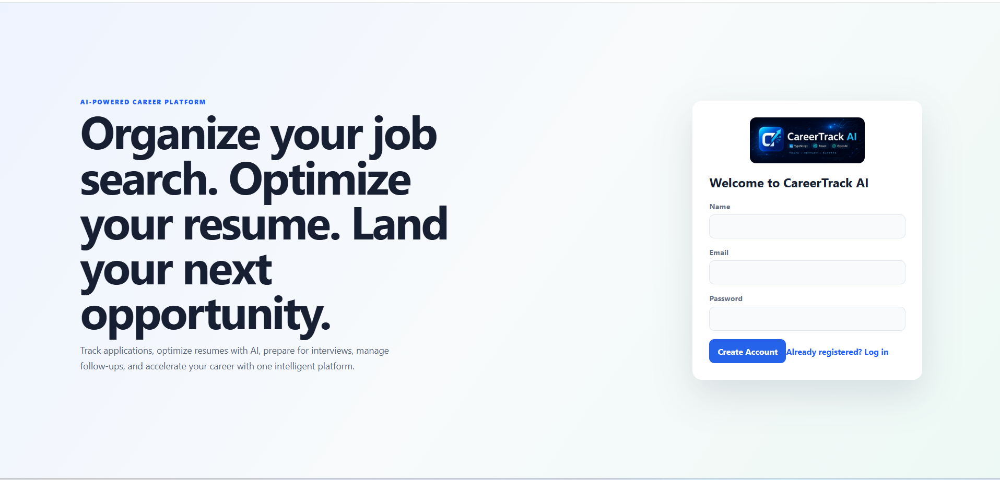
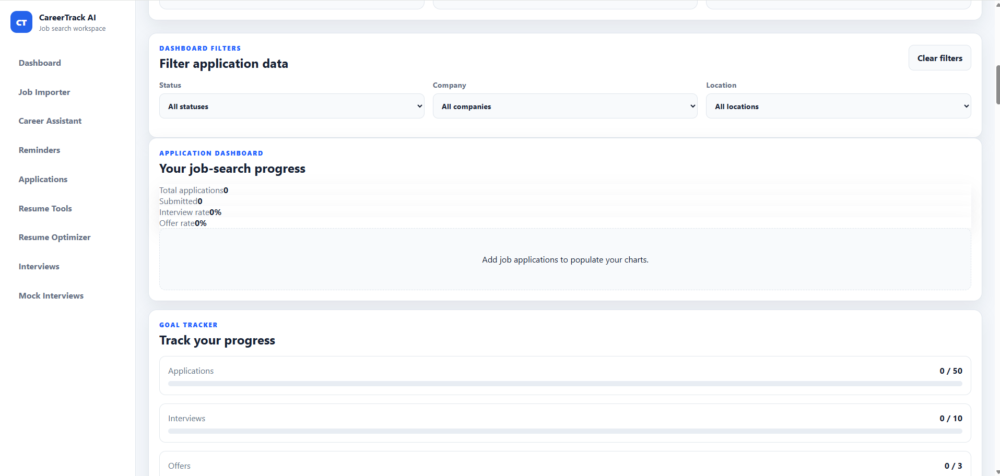
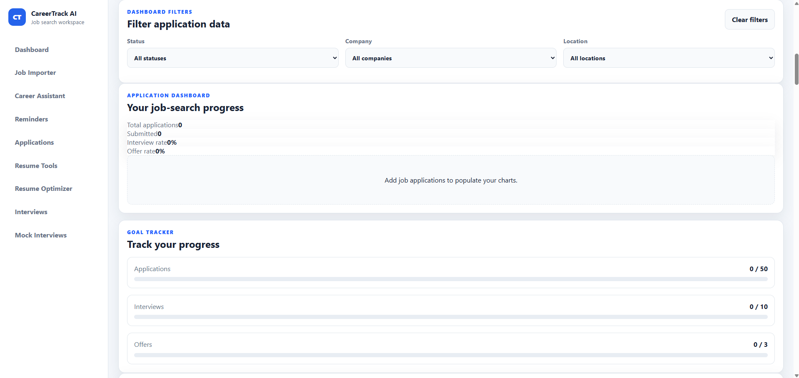
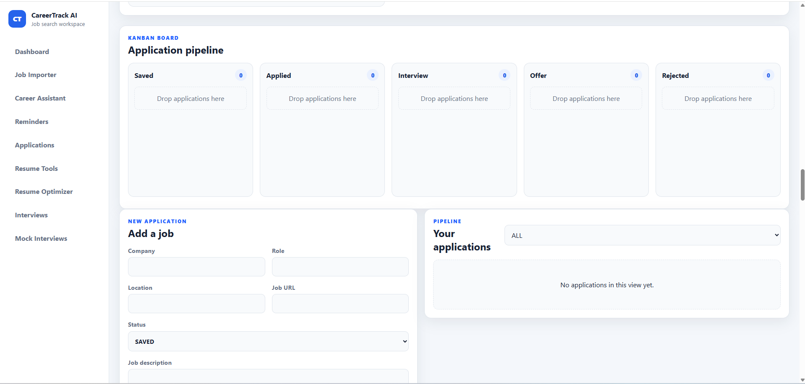
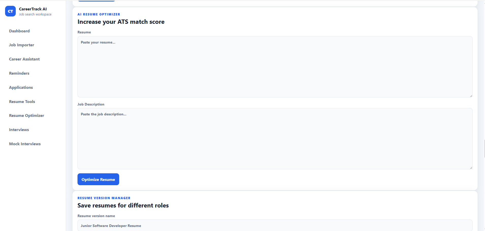
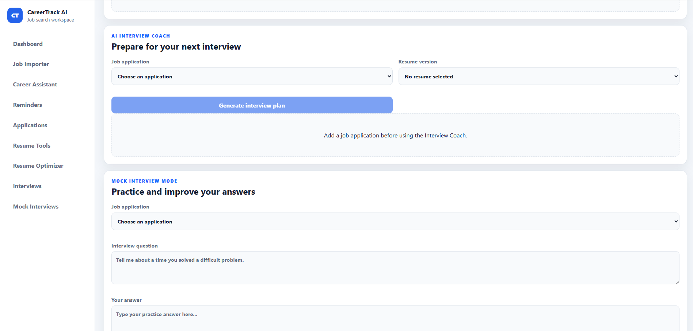
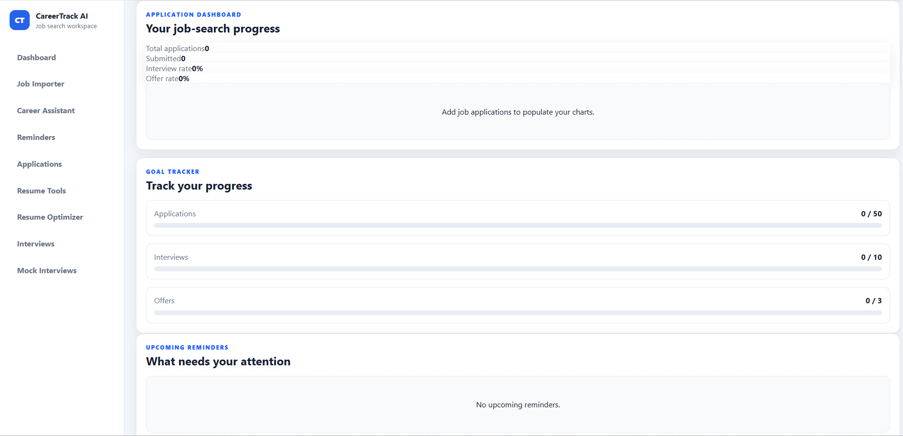
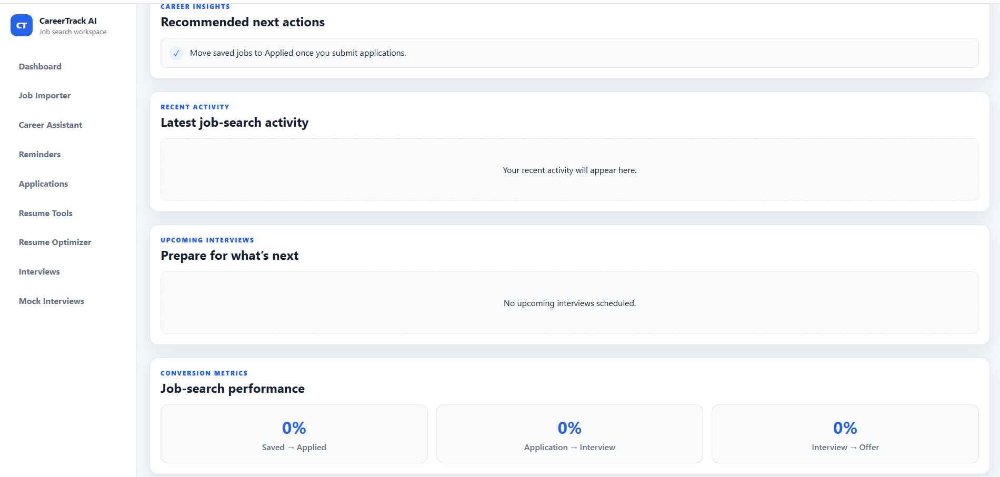

# CareerTrack AI

> An AI-powered career management platform that helps job seekers organize applications, optimize resumes, prepare for interviews, and land their next opportunity.

## 🚀 Live Demo

**Application:** https://careertrack-ai.vercel.app

**API:** https://careertrack-ai.onrender.com

---

# Screenshots

## Login



## Dashboard



## Job Application Tracker



## Kanban Board



## Resume Optimizer



## Interview Coach



## Analytics



## Career Assistant



---

# Features

- 🔐 JWT Authentication
- 📋 Job Application Management
- 📊 Analytics Dashboard
- 📌 Kanban Workflow
- 🤖 AI Resume Optimizer
- ✍️ AI Cover Letter Generator
- 🎤 AI Interview Coach
- 💬 AI Career Assistant
- 📅 Reminder Management
- 📈 Resume Version Manager
- 🌙 Dark Mode
- ☁️ Cloud Deployment

---

# Technology Stack

### Frontend

- React
- TypeScript
- Vite

### Backend

- Node.js
- Express
- TypeScript

### Database

- PostgreSQL
- Prisma ORM

### AI

- OpenAI API

### Deployment

- Vercel
- Render

---

# Architecture

```
React
   │
Express REST API
   │
Prisma ORM
   │
PostgreSQL
   │
OpenAI API
```

---

# Installation

## Server

```bash
cd server
npm install
npm run dev
```

## Client

```bash
cd client
npm install
npm run dev
```

---

# Future Enhancements

- LinkedIn job import
- Google Calendar integration
- AI networking assistant
- Mobile application
- Recruiter dashboard
- Advanced analytics
- Email automation

---

# Developer

**Kevin Jordan**

- Bachelor of Science, Information Technology – Software Engineering - University of Phoenix
- Assosiate Arts, Foundation of Business - University of Phoenix
- University of Kansas Full Stack Web Development Boot Camp

---

Built using React, TypeScript, Node.js, PostgreSQL, Prisma, OpenAI, Render, and Vercel.
